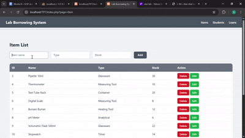
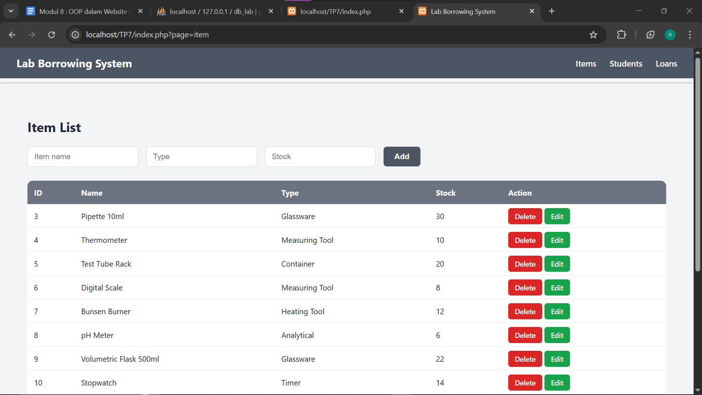
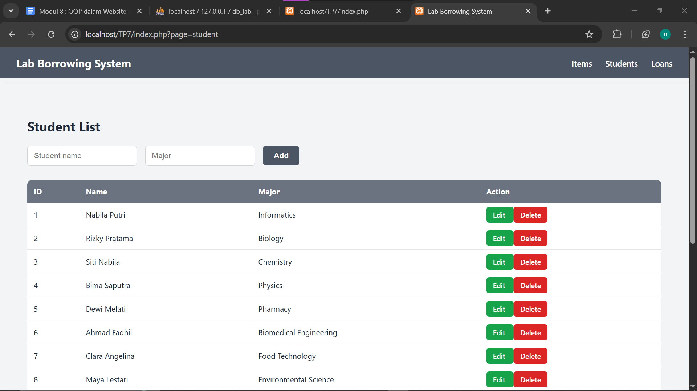
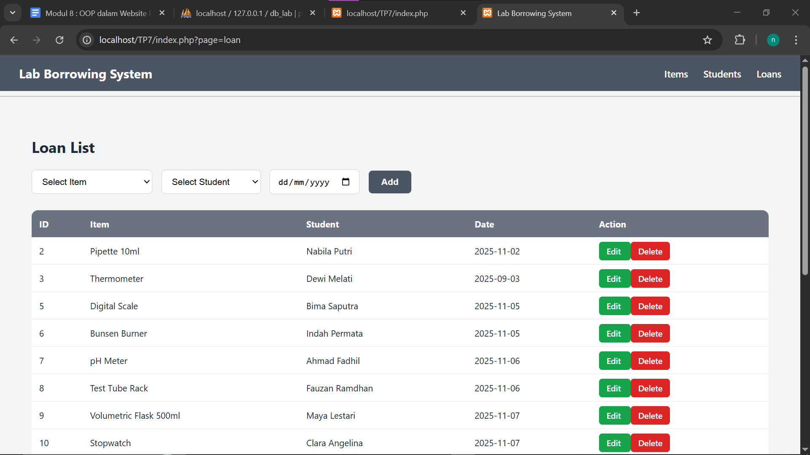

# TP7DPBO2425C2

Saya Niha April Miani dengan NIM 2402567 mengerjakan Tugas Praktikum 7 dalam mata kuliah Desain Pemogramana Berorientasi Objek untuk keberkahanNya maka saya tidak melakukan kecurangan seperti yang telah dispesifikasikan. Aamiin

# Lab Borrowing Management System 
Project  sebuah aplikasi sederhana untuk mengelola peminjaman alat laboratorium.
 Website dibangun menggunakan:
- PHP berbasis OOP
- PDO + Prepared Statement untuk seluruh query
- MySQL sebagai database
- Arsitektur terpisah: Model (class), View, Router
Tujuan utama sistem ini adalah menyediakan fitur CRUD terhadap tiga entitas:
 Item, Student, dan Loan.

# Tema Web
Tema web ini adalah Sistem Peminjaman Alat Laboratorium.
Fungsinya:
- Menyimpan daftar alat laboratorium yang tersedia
- Menyimpan daftar mahasiswa yang dapat meminjam alat
- Mencatat transaksi peminjaman alat oleh mahasiswa
Semua data tersimpan dengan rapi menggunakan relasi antar tabel.

# Struktur Database 
Database bernama db_lab, terdiri dari tiga tabel:
1. Tabel item
Menampung daftar alat laboratorium.
 Data yang disimpan meliputi:
- id alat
- nama alat
- jenis alat
- stok alat
  
2. Tabel student
Menampung data mahasiswa yang menjadi peminjam alat.
 Data yang disimpan meliputi:
- id mahasiswa
- nama mahasiswa
- jurusan/program studi

3. Tabel loan
Tabel ini mencatat setiap peminjaman alat.
 Di dalamnya terdapat:
- id peminjaman
- id alat yang dipinjam (mengarah ke tabel item)
- id mahasiswa peminjam (mengarah ke tabel student)
- tanggal peminjaman

## Relasi Antar Tabel ##
- Kolom id_item pada tabel loan menunjuk ke id pada tabel item.
- Kolom id_student pada tabel loan menunjuk ke id pada tabel student.
Dengan demikian, tabel loan menjadi penghubung antara item dan student.

# Flow / Alur Program 
## 1. index.php sebagai Router Utama ##
index.php bertugas menentukan halaman mana yang harus ditampilkan.
Jika URL mengandung:
- ?page=item → tampilkan halaman item
- ?page=student → tampilkan halaman student
- ?page=loan → tampilkan halaman loan
index.php juga meng-include:
- header.php di bagian atas
- footer.php di bagian bawah
Sehingga seluruh halaman konsisten tampilannya.

## 2. Folder class/ – Model OOP ##
Semua proses database dilakukan di dalam class.
Di sini terdapat 3 class:

a. Item.php
Berfungsi mengelola data tabel item, termasuk:
- mengambil semua data (getAll)
- mengambil satu data berdasarkan id (getById)
- menambah alat (insert)
- memperbarui alat (update)
- menghapus alat (delete)
Semua dilakukan dengan prepared statement (PDO).

b. Student.php
Mengelola data mahasiswa, dengan fungsi:
- getAll (read)
- getById (ambil data satu mahasiswa)
- insert
- update
- delete
  
c. Loan.php
Mengelola transaksi peminjaman:
- getAll → melakukan JOIN item & student
- getById
- insert
- update
- delete
Loan adalah tabel yang memiliki relasi ke 2 tabel lain.

## 3. Folder view/ – Halaman CRUD ##
Setiap entitas memiliki file tampilan sendiri:

a. item_view.php
Flow kodenya:
1. Mengecek apakah user mengirim form Add
2. Jika ya → memanggil fungsi insert()
3. Mengecek apakah user ingin update
4. Jika yes → memanggil update()
5. Mengecek apakah user ingin Delete
6. Jika ya → memanggil delete()
7. Menampilkan form Add/Edit
8. Menampilkan tabel list item

b. student_view.php
Flow-nya sama:
1. Add student
2. Edit student → memanggil getById()
3. Update student
4. Delete student
5. Tampilkan data mahasiswa

c. loan_view.php
Flow sedikit berbeda karena ada relasi antar tabel.
1. Add loan (select item + student + tanggal)
2. Edit loan → mengambil data asal
3. Update loan
4. Delete loan
5. List loan ditampilkan menggunakan JOIN
Pada tampilan tabel, yang muncul adalah:
- nama item (bukan id)
- nama student (bukan id)
- tanggal peminjaman

## 4. style/style.css ##
Berisi gaya sederhana:
- layout
- tabel
- tombol
- header
- form

# Kesimpulan
Flow aplikasi berjalan seperti ini:
User klik menu → index.php menentukan halaman → view tampil
→ view memanggil class model → model melakukan query PDO
→ data dikembalikan → tampil di tabel → user bisa Add/Edit/Delete

Dan semua fungsi CRUD bekerja lengkap pada:
- Item
- Student
- Loan
Dengan seluruh query database menggunakan prepared statement.

# Dokumentasi
## Record CRUD ##

## Item ##

## Student ##

## Loan ##

